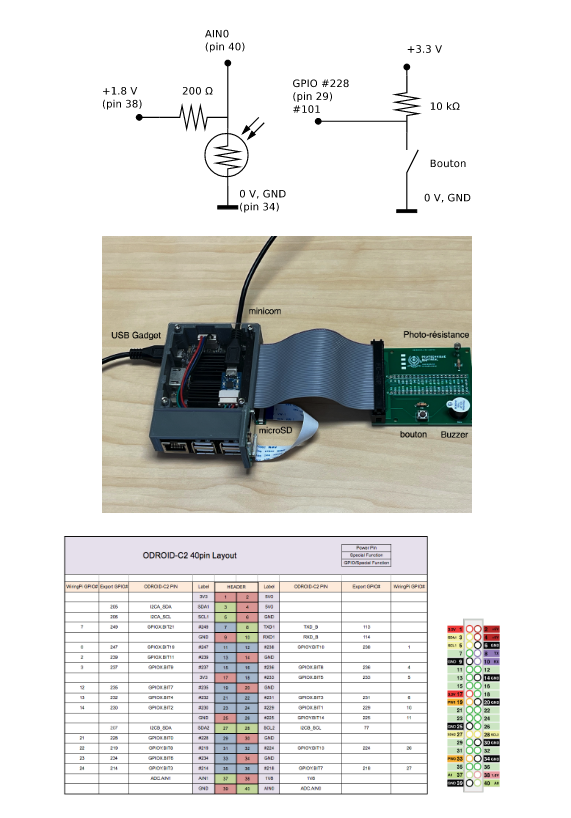

# Projet - Système de vision basé sur une caméra USB

Ce projet utilise un Odroid-C2 et une caméra afin de permettre à l'utilisateur de prendre une photo pour ainsi entrainer un modèle de détection de visages afin d'en faire la reconnaissance en affichant le nom de la personne.

Une communication TCP IP est utilisé entre un serveur et un client afin d'afficher l'image en temps réel et d'envoyer des messages entre les deux qui permettent d'effectuer les changements sur l'image. 

Un buzzer est connecté à l'Odroid qui s'active lors de la reconnaissance, et un son différent sort dépendamment de si la face a été reconnu ou non.


## Pré-Requis

Ce projet requiert les éléments suivants afin de le reproduire :

* Odroid-C2
* Caméra USB
* Push Button
* Résistance de 200 Ohms


## Installation

La premiere étape est de cloner ce programme dans votre répertoire locale par : 

```
git clone git@bitbucket.org:rgourdeau/ele4205_projet_aut2023_19.git
``` 

Une fois le répertoire cloné, si ce n'est déja pas fait, il faut premièrement établir la connexion ssh : 

``` 
%minicom
%rm ~/.ssh/known_hosts
$sudo /users/Cours/ele4205/commun/scripts/ifconfig-enp0s-up
%ssh root@192.168.7.2
``` 

Dans le côté serveur, on build le projet par les commandes : 
``` 
%cd serveur/cross/
%mkdir build
%cd build
$source /usr/local/opt/poky/2.1.3/environment-setup-aarch64-poky-linux
$cmake  ../../cross/ -DCMAKE_BUILD_TYPE=Debug
$make
$scp serveur root@192.168.7.2:/home/root
$scp serverBuzzer root@192.168.7.2:/home/root
``` 
 
Il faut créer deux répertoires dans le dossier du client afin de stockées les images prises lors de l'éxécution du programme.
``` 
%cd client
%mkdir Detection
%mkdir Image
``` 

Pour build le projet au niveau du client :
``` 
%cd client/
%mkdir build
%cd build
$cmake -DCMAKE_BUILD_TYPE=Release ..
$make
``` 

Installation des fichiers requis du buzzer : 
``` 
root@odroid-c2:~# modprobe pwm-meson
root@odroid-c2:~# modprobe pwm-ctrl
``` 

Pins de l'odroid utilisé :




## Fonctionnement

Pour lancer le logiciel, il faut tout d'abord démarrer le côté serveur afin qu'il puisse attendre une connection de la part du serveur. Ceci peut se faire directement sur le terminal par ssh ou sur celui dans l'IDE.

``` 
% ssh root@192.168.7.2
root@odroid-c2:~#./serveur
``` 

Une fois le message "attente d'une connection" affiché sur le terminal, on démarre le programme du client, le IDE utilisé pour ce projet est celui de VS Code. 

Lorsque le message "Connexion réussi" apparait dans le client, on projette de la lumière à l'ADC du serveur pour que celui-ci ait une valeur inférieure à 800 pour ainsi activer la caméra. Cette valeur est affichée dans le terminal du serveur.

### Touches clavier du programme 

* 'W' : changer le format de l'image en JPEG
* 'Q' : changer le format de l'image en PNG

* '1' : changer la résolution de l'image à 160 x 120
* '2' : changer la résolution de l'image à 352 x 288
* '3' : changer la résolution de l'image à 960 x 720
* '4' : changer la résolution de l'image à 1280 x 720

* 't' : mode apprentissage
* 'r' : mode reconnaissance

* 'ESC' : fermer le programme

### Mode apprentissage

Lors du mode apprentissage, l'utilisateur doit attendre une période de temps pour amasser une quantité suffisante d'images pour soit créer ou mettre à jour le model de reconnaissance, soit le fichier DatasetFace.yml. Durant ce temps, seuls les images avec "VISAGE DETECTE" sont stockées. L'apprentissage débute par la touche 't' suivi du boutton de l'odroid lorsqu'il est pesé. Dans ce mode, le programme va vous demander d'écrire votre nom dans le terminal. Un ID est généré automatiquement en fonction du nom (équivalent ASCII) et ces deux valeurs sont stockées dans le fichier NamesAndID.txt qui sera utilisé pour la reconnaissance.           


### Mode reconnaissance

Ce mode s'active lorsque le bouton de l'odroid est pesé à la suite de la commande 'r', et compare la derniere image transmise par l'odroid avec les données du modele. Plusieurs visages peuvent etre reconnus lors de ce mode. 


### Messages envoyées

Durant l'éxécution de la connexion TCP IP, différents messages sont envoyés entre le serveur et le client : 

* "QUIT" : le client souhaite fermer le programme
* "OK" : le client attend une autre image
* "RES01, RES02, RES03, RES04" : changement de la résolution
* "FORMAT_PNG, FORMAT_JPEG" : changement du format de l'image
* "READY" : "il y a de la lumière sur l'ADC et on peut transférer l'image
* "IDOWN" : le client ne demande pas d'image (pas de lumière sur l'ADC)
* "PUSB" : le client pèse sur le boutton et l'image est sauvegardée en local (par un fork)
* "LEARN" : le client entre dans le mode apprentissage
* "KNOWN" : le programme a reconnu un visage (buzzer émet un son)
* "UNKNOWN" : le programme a reconnu aucun visage (buzzer émet un différent son)

## Références

Énoncé du Projet (PDF) : Projet - Système de vision basé sur une caméra USB

(serveur.cpp -> captureVideo(int res1, int res2))
[Code boneCVtimming.cpp de Molloy](https://github.com/derekmolloy/boneCV/blob/master/boneCVtiming.cpp)

(serveur.cpp, serverBuzzer.cpp, client.cpp -> connection())
[Socket Programming in C/C++](https://www.geeksforgeeks.org/socket-programming-cc/)

(faces.cpp detectVisagesReconnaissances(string imgPath, int index) et detectVisageApprentissage(Mat image))
[OpenCV C++ Program for Face Detection](https://www.geeksforgeeks.org/opencv-c-program-face-detection/)

(faces.cpp)
[OpenCV 2.4.5.0 documentation](https://docs.opencv.org/2.4.5/)

(faces.cpp -> getNameFromID(int label))
[to extract data from text file using c98 linux](https://stackoverflow.com/questions/66241192/to-extract-data-from-text-file-using-c98-linux)


